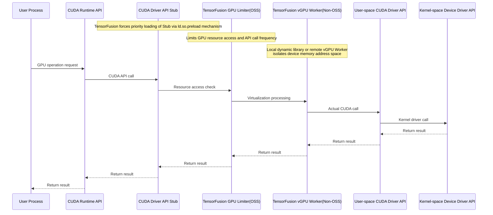
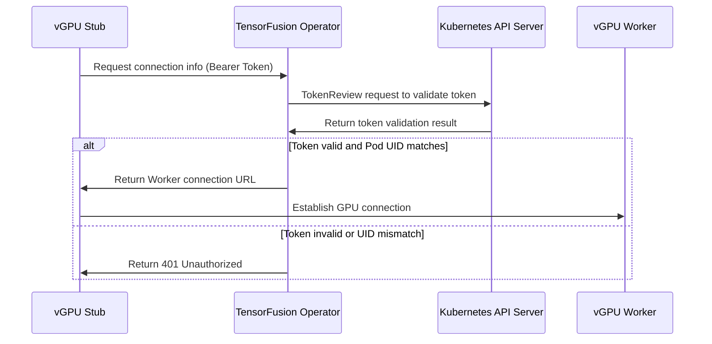
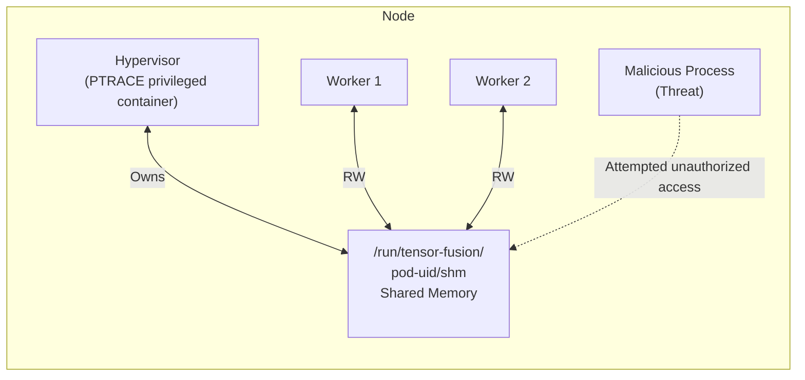
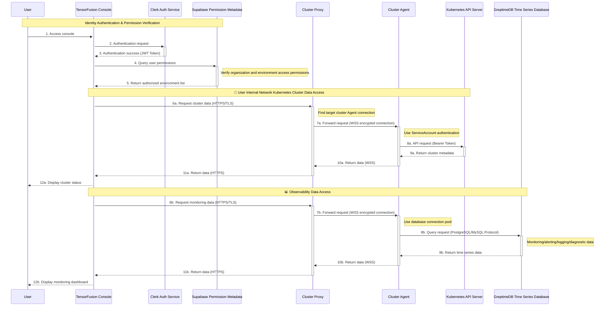

# TensorFusion Security Whitepaper

## 1. System Overview and Architecture

### 1.1 System Architecture

#### Architecture Diagram of Embedded vGPU Mode

#### Architecture Diagram of Remote vGPU Mode

The architecture diagrams above illustrate the high-level architecture of TensorFusion services, including the components that comprise TensorFusion, trust boundaries, and communication paths.

**Scope**: This threat model covers only TensorFusion services. Related components such as time-series databases, AI models, and frameworks are outside the scope of this assessment.

**Objective**: This assessment aims to identify potential threats to TensorFusion services that could be exploited by external attackers to compromise or infiltrate customer cloud environments or data centers.

### 1.2 System Components

TensorFusion's core components include:

- **TensorFusion Operator**: Central orchestration component for managing and scheduling GPU resources, running in-process submodules including Controller, AdmissionWebhook, Scheduler, AlertEvaluator, MetricsRecorder, and Scaler. It also starts one-time NodeDiscovery Job to report GPU nodes
- **Hypervisor**: Node-level component handling GPU virtualization, managing time-slice allocation, status monitoring, and performance statistics for multiple vGPU Workers on GPU nodes
- **vGPU Worker**: Provides user-space vGPU implementation for applications, offering GPU access interfaces and handling GPU system calls. In Local vGPU mode, the Worker runs as a dynamic library embedded in user processes
- **vGPU Client Stub**: Present only in Remote vGPU mode, embedded as a dynamic library in user processes, working with Worker to provide GPU access interfaces and handle GPU system calls

### 1.3 System Permissions

TensorFusion is a distributed system involving multiple trust boundaries, including Kubernetes clusters, Kubernetes nodes, Pod networks, and Pod container runtime environments. The following are all permissions required for system operation:

**Operator Component Kubernetes Permissions**:
- TensorFusion custom resource permissions: For TensorFusion core functionalities
- Read/write permissions for Kubernetes native workload and configuration resources (excluding Secret permissions): For TensorFusion core functionalities
- Query and create permissions for Karpenter custom resources: For creating cloud provider nodes during Karpenter integration (removable when not using Karpenter)
- Kubernetes TokenReview permissions: For validating requests from vGPU Stub to obtain vGPU Worker connection information
- Pod/bind subresource permissions: For TensorFusion custom GPU scheduler to bind Kubernetes nodes
- Pod/exec subresource permissions: For ClusterAgent to forward console WebShell requests (removable when not using WebShell)
- Lease read/write permissions: For Controller leader election

Reference: https://github.com/NexusGPU/tensor-fusion/blob/main/charts/tensor-fusion/templates/rbac.yaml

**Hypervisor Component Kubernetes Permissions**:
- Kubernetes TokenReview permissions: For validating requests from vGPU Worker to obtain quota information
- Read-only permissions for Node/Pod/Namespace resources: For obtaining Pod information on GPU nodes
- Query permissions for GPU/GPUNode custom resources: For obtaining and updating GPU information

Reference: https://github.com/NexusGPU/tensor-fusion/blob/main/charts/tensor-fusion/templates/rbac-hypervisor.yaml

**Pod Container Runtime Permissions**:
- NodeDiscovery/Hypervisor component access to all GPU devices on nodes: Through NVIDIA_VISIBLE_DEVICES=all environment variable, enabling NVIDIA Container Toolkit-configured CRI Hooks to inject device file descriptors and modify cgroup restrictions for accessing all GPU devices on nodes
- Worker component similarly mounts all GPU devices through this environment variable, but through libcuda_limiter.so injection into all processes, can only access scheduler-allocated GPUs
- Hypervisor component's Init Container runs in privileged mode for one-time initialization of tmpfs shared memory mount points on nodes, used for inter-process communication between Hypervisor and Worker
- Hypervisor component's main container has SYS_PTRACE system call capability for reading vGPU Worker-related information in /proc filesystem
- Other workloads have no additional permissions

Reference: https://github.com/NexusGPU/tensor-fusion/blob/main/internal/utils/compose.go#L452

### 1.4 System Configuration

1. ConfigMap/tensor-fusion-sys-config/config/scheduler-config.yaml: Includes scheduler-related configuration with data structure [identical to Kubernetes Scheduler](https://kubernetes.io/docs/reference/config-api/kube-scheduler-config.v1/#kubescheduler-config-k8s-io-v1-KubeSchedulerConfiguration)
2. ConfigMap/tensor-fusion-sys-config/config/dynamic-config.yaml: Includes [other dynamic configurations](./helm-install-values.md#properties-helm-values-dynamicConfig) for system operation, such as monitoring and alerting configurations
3. ConfigMap/tensor-fusion-sys-public-gpu-info/gpu-info.yaml: Enumerates mainstream GPU models and performance benchmarks for GPU resource identification
4. MutatingWebhookConfiguration/tensor-fusion-sys-mutating-webhook
5. Secret/tensor-fusion-webhook-secret: TLS certificate for AdmissionWebhook HTTPS server, generated by temporary Job (kube-webhook-certgen) during Helm installation and automatically deleted after completion

### 1.5 Implemented Security Controls

#### Core GPU Virtualization Layer

1. Both Local/Remote vGPU modes implement memory address isolation and fault isolation to prevent vGPU privilege escalation risks (memory address isolation not provided when running only open-source vgpu.rs component; memory isolation provided by proprietary tensor-fusion-worker component)
2. For Remote vGPU client connection requests, uses Kubernetes ServiceAccount mechanism for authentication and authorization to prevent forged requests causing GPU resource abuse (Remote vGPU Stub is proprietary component)
3. Worker and Hypervisor inter-process communication through shared memory uses Kubernetes ServiceAccount mechanism for authentication and authorization to prevent request forgery and privilege escalation

#### Orchestration and Scheduling Layer

1. Provides namespace-level quota limitation functionality to reduce GPU resource abuse risks
2. TLS encryption for Kubernetes API and AdmissionWebhook
3. TensorFusion components implement principle of least privilege
4. All critical components deployed privately to reduce attack surface

#### Cloud Console

1. Authentication, authorization, and TLS encryption between cloud console and Cluster Agent
2. Cloud console and ClusterAgent serve only as request proxies without data storage; ClusterAgent component can be removed for complete intranet mode operation to reduce data leakage risks
3. Cloud console integrates with secure and reliable PaaS/SaaS service providers, such as: Cloudflare for DDoS and WAF protection; Clerk user system for authentication and authorization; Supabase/Upstash for secure database and cache access; Pulumi for secure key management and infrastructure automation

## 2. Threat Model Analysis

### 2.1 Asset Classification

**Critical Assets and Data:**
- A1: GPU hardware resources and allocation status
- A2: Authentication tokens used for remote GPU sharing
- A3: Kubernetes cluster API Server access credentials
- A4: User workloads in Kubernetes clusters managed by TensorFusion
- A5: TensorFusion component configuration information
- A6: System monitoring metrics and performance data
- A7: Cloud console login session information
- A8: Authentication tokens for communication between cloud console and ClusterAgent

### 2.2 Potential Threat Actors

- **External Attackers**: Exploit exposed system APIs to abuse GPU resources or steal sensitive data from AI workloads
- **Malicious Insiders**: Leverage legitimate cluster access permissions to escalate privileges or abuse GPU resources
- **Supply Chain Attacks**: Exploit compromised dependencies or container images to inject malicious code, abuse GPU resources, or steal sensitive data from AI workloads

### 2.3 STRIDE Threat Classification Reference

|Threat Type|Desired Property|Threat Definition|
|---|---|---|
|Spoofing|Authenticity|Impersonating another identity or entity|
|Tampering|Integrity|Modifying data on disk, network, memory, or other locations|
|Repudiation|Non-repudiation|Claiming not to have performed an action or denying responsibility; may be honest or false|
|Information Disclosure|Confidentiality|Unauthorized access to information|
|Denial of Service|Availability|Exhausting resources required to provide service|
|Elevation of Privilege|Authorization|Allowing execution of unauthorized operations|

### 2.4 Security Threat Analysis

#### TM01: Cross-Tenant vGPU Memory Privilege Escalation (Tampering, Information Disclosure, Elevation of Privilege)

Malicious users may attempt to access other tenants' GPU memory data through GPU memory address manipulation, causing data leakage or privilege escalation. Attackers may exploit GPU memory management vulnerabilities to bypass virtualization isolation mechanisms and read or modify GPU memory content of other workloads.

**Mitigations**:
1. Implement memory address isolation mechanisms to ensure complete memory space isolation between different vGPU instances
2. Implement fault isolation to prevent errors in one vGPU instance from affecting other instances
3. Use VRAM manager to control memory allocation and access permissions

**Status**: Partially mitigated in Local vGPU mode; mitigated in Remote vGPU mode and VM mode.

**Note**:
- In Local vGPU mode, Stub and Worker run in the same process as user processes, making it impossible to completely prevent untrusted users from bypassing Stub to directly access GPU devices by modifying GPU quota information in shared memory
- In Worker independent process mode, vGPU access control for untrusted tenants is secure and effective, including:
  - VM mode in non-container environments: Worker runs on Host, communicating with Stub in virtual machines through shared memory devices
  - Remote vGPU mode: Stub and Worker run in independent containers, communicating via TCP/IP or IB networks

#### TM02: Remote vGPU Connection Request Forgery (Spoofing, Elevation of Privilege)

Unauthorized clients may forge ServiceAccount tokens or bypass authentication mechanisms to gain connection permissions to GPU Workers, leading to resource abuse and unauthorized access.

**Mitigations**:
1. Use Kubernetes ServiceAccount mechanism for client authentication
2. Verify Pod UID in token matches Owner Reference of connection resource
3. Implement token caching mechanism to reduce API Server load and improve validation efficiency

**Status**: Mitigated

#### TM03: Hypervisor-Worker IPC Communication Hijacking (Spoofing, Tampering, Information Disclosure)

Malicious processes may attempt to hijack or eavesdrop on inter-process communication between Hypervisor and Worker through shared memory channels to obtain GPU quota information or inject malicious commands.

**Mitigation Measures**:
1. ServiceAccount token validation before Worker-Hypervisor communication
2. Use privileged init container to configure shared memory mount points with proper access permissions
3. Hypervisor container gains SYS_PTRACE capability to monitor related process status

**Status**: Mitigated

#### TM04: Unauthorized Kubernetes API Access (Spoofing, Elevation of Privilege)

Attackers may attempt to exploit over-privileged ServiceAccount permissions to perform operations beyond component responsibilities, such as accessing cluster-sensitive resources or modifying critical configurations.

**Mitigation Measures**:
1. Implement principle of least privilege with dedicated RBAC permissions for each component
2. Hypervisor component only receives necessary TokenReview and resource query permissions
3. Remove unnecessary permissions such as WebShell and Karpenter permissions when not in use

**Status**: Mitigated

#### TM05: AdmissionWebhook Tampering (Tampering, Elevation of Privilege)

Malicious users may attempt to modify MutatingWebhookConfiguration to bypass Pod injection controls or insert malicious code into workloads.

**Mitigation**:
1. Use TLS encryption to protect AdmissionWebhook communication
2. Manage Webhook TLS certificates through dedicated Secret
3. Implement admission controller authentication to ensure only authorized Webhooks can modify Pod specifications
4. Cluster admin controls Webhook configuration and make sure only authorized Webhooks can be added

**Status**: Mitigated

#### TM06: GPU Resource Quota Bypass (Denial of Service, Elevation of Privilege)

Malicious users may attempt to request excessive GPU resources, preventing other users from obtaining resources or degrading system performance.

**Mitigation**:
1. Implement namespace-level quota limitation functionality to prevent resource abuse
2. Use QoS system to provide tiered service quality guarantees
3. Monitor resource usage through monitoring and alerting mechanisms

**Status**: Mitigated

#### TM07: Inter-Component Communication Eavesdropping (Information Disclosure)

Network attackers may attempt to intercept communication between TensorFusion components to obtain sensitive authentication tokens or workload metadata.

**Mitigations**:
1. Use TLS encryption for all cloud console API access
2. Support complete intranet mode deployment, removing external communication dependencies

**Status**: Partially mitigated. Kubernetes intranet communication between Remote vGPU Stub/Worker is not encrypted at application layer, relying on user's Kubernetes CNI network configuration for traffic encryption.

#### TM08: Supply Chain Attacks (Tampering, Elevation of Privilege)

Attackers may inject malicious code into TensorFusion components through compromised container images or dependencies to gain system control privileges.

**Mitigations**:
TensorFusion's development process and DevOps pipeline adopt security best practices recommended for GitHub open-source projects, continuously optimizing software supply chain security. Implemented security controls include but are not limited to:

1. Use secure container image build artifacts
2. Enable Dependabot for regular dependency updates and security patches
3. Use CodeQL for code security scanning
4. Use FOSSA Scan for open-source dependency compliance and license validation
5. Team GitHub accounts enable MFA, following principle of least privilege
6. CI/CD pipeline secrets managed through GitHub Secrets

**Status**: Partially mitigated, continuously improving.

## 3. Data Privacy

### 3.1 Fully Private Deployment Mode

TensorFusion supports fully private deployment mode, significantly reducing the risk of external data leakage. The data plane Worker components process GPU system calls in memory in real-time. Local GPU mode has no cross-process transmission, Remote GPU mode only transmits binary data, and only monitoring data is persisted to disk, eliminating customer data leakage risks.

### 3.2 Cloud Console + Core Component Private Deployment Mode

When the cloud console is enabled, users authenticate through Clerk and can access Kubernetes cluster metadata, monitoring/alerting/logging/diagnostic reports, and other observability data within their organization based on role permissions.

The cloud access flow is as follows:

The interaction flow between the cloud console and ClusterAgent components implements several key security features:
- TLS encryption
- Principle of least privilege
- No data persistence
- Zero-trust architecture

Therefore, TensorFusion console design significantly mitigates data leakage risks and ensures user data privacy.

## Conclusion

TensorFusion adopts best security practices from cloud-native and virtualization domains, ensuring secure design by default in vGPU Host/Guest isolation, system authentication and authorization, resource management, data privacy, and software supply chain. Key implemented security controls include:
- Multiple vGPU isolation solutions ensuring resource quota security for multiple untrusted tenants, mitigating compute resource abuse risks, while appropriately reducing isolation in trusted tenant scenarios to balance performance
- Kubernetes RBAC and AdmissionWebhook principle of least privilege ensuring secure distributed component interactions
- All core components deployed privately ensuring data privacy and significantly mitigating availability risks
- Optional cloud console with limited encrypted data transmission and no data persistence ensuring secure control plane access
- Development processes and CI/CD pipelines adopting GitHub open-source project security practices, enhancing software supply chain security

In summary, TensorFusion's system architecture, when properly configured, supports secure multi-tenant virtual GPU sharing and large-scale GPU pool management and scheduling. Continuous attention to deployment security practices, enhanced defense in depth, and ongoing security improvements are required.
