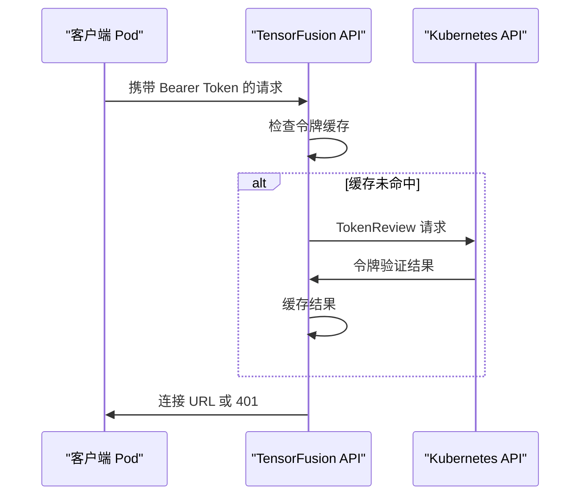

# TensorFusion 安全白皮书

## 1. 系统概述与架构

### 1.1 系统架构

The above diagram describes the high level architecture of the TensorFusion service, including the components, trust boundaries, and communication paths that make up the TensorFusion service. Some communication paths on duplicated components were removed to simplify the diagram.

Scope: Only the TensorFusion service is in scope for this threat modeling, all other components, such as <XYZ> and <ABC>, are out of scope for this review.

Goals: The goal of this review is to find potential threats around the TensorFusion service, which can be utilized by external attackers to attack or to penetrate customer's cloud or data center.

### 1.2 系统组件

TensorFusion的核心组件包括：

- **控制器/管理器Operator**：管理和调度GPU资源的中央编排组件，在进程内运行了Controller、AdmissionWebhook、Scheduler、AlertEvaluator、MetricsRecorder、Scaler等子模块
- **虚拟化管理器Hypervisor**：处理GPU虚拟化的节点级组件，处理GPU节点上多个vGPU Worker的时间片分配、状态监控、性能统计等
- **工作节点vGPU Worker/Client**：为应用程序提供用户态的vGPU实现，提供GPU访问接口，处理GPU系统调用，

### 1.3 系统权限

系统分布式运行，涉及多种类型的信任边界，包括 Kubernetes集群、Kubernetes节点、Pod网络、Pod内部容器运行时环境。

Operator组件的Kubernetes权限：
- 
- 
- https://github.com/NexusGPU/tensor-fusion/blob/main/charts/tensor-fusion/templates/rbac.yaml

Hypervisor组件的Kubernetes权限：
- https://github.com/NexusGPU/tensor-fusion/blob/main/charts/tensor-fusion/templates/rbac-hypervisor.yaml

节点权限：

Pod内部容器运行时权限：

### 1.4 系统配置项

### 1.5 已实施的安全保障措施

## 2. 威胁模型分析

### 2.1 资产分类

**关键资产：**
- A1: GPU 硬件资源和分配状态
- A2: 认证令牌和服务账户凭据
- A3: Kubernetes 集群访问和 RBAC 权限 
- A4: AI 工作负载数据和模型信息

**敏感数据：**
- S1: GPU 利用率指标和性能数据
- S2: Pod 和容器元数据
- S3: 网络连接信息

### 2.2 潜在威胁行为者

- **外部攻击者**：针对暴露的API或网络服务，试图滥用资源
- **恶意内部人员**：具有合法集群访问权限，但试图提升权限的用户
- **供应链攻击**：受损的依赖项或容器镜像

### 2.3 STRIDE威胁分类参考

|Threat|Desired property|Threat Definition|
|---|---|---|
|Spoofing|Authenticity|Pretending to be something or someone other than yourself|
|Tampering|Integrity|Modifying something on disk, network, memory, or elsewhere|
|Repudiation|Non-repudiability|Claiming that you didn't do something or were not responsible; can be honest or false|
|Information disclosure|Confidentiality|Someone obtaining information they are not authorized to access|
|Denial of service|Availability|Exhausting resources needed to provide service|
|Elevation of privilege|Authorization|Allowing someone to do something they are not authorized to do|

### 2.4 安全威胁分析

#### TM1：访问控制失效

访问控制数据流

**风险级别**：高

系统实现了全面的 RBAC 控制，对集群资源具有广泛权限。然而，广泛的权限范围存在风险：

**已实施的缓解措施：**
- TensorFusion 自定义资源的细粒度 RBAC 权限 
- 使用 Kubernetes TokenReview API 进行服务账户令牌验证 
- 带有 LRU 缓存的 JWT 令牌认证以提升性能 

#### TM2：加密失效风险

**缓解措施：**
- 支持指标端点和 webhook 通信的 TLS 加密 
- 准入 webhook 的基于证书的认证

**已识别的缺口：**
- 可通过环境变量禁用连接认证 

**状态**：已缓解

#### TM3：注入攻击

**风险级别**：低

系统主要使用 Kubernetes API 交互，而非传统的 SQL 或命令注入向量。但是，资源验证通过准入 webhook 实现。

TSDB组件使用了GreptimeDB，通过Vector采集指标数据。

GreptimeDB默认的Standalone模式部署无秘钥可访问，需要在部署时考虑GreptimeDB的最佳安全实践，或使用GreptimeDB的云服务。

### 3.4 A04：不安全设计

**风险级别**：中等

**安全设计元素：**
- 准入 webhook 验证资源完整性
- 组件间的服务账户隔离
- 基于环境变量的安全控制功能开关 

### 3.5 A05：安全配置错误

**风险级别**：高

**风险因素：**
- 多个环境变量可以禁用安全功能 
- RBAC 配置中的广泛通配符权限 

### 3.9 A09：安全日志和监控失效

**风险级别**：中等

**当前日志记录：**
- 认证事件与连接上下文一起记录 
- 令牌验证失败被记录 

#### TM9：安全日志和监控失效

**风险级别**：中等

有限的外部 API 交互降低了 SSRF 风险，尽管 Kubernetes API 访问可能存在潜在向量。

## 4. 数据流安全分析

### 4.1 认证流程

### 4.2 GPU 资源分配流程

系统通过受 RBAC 保护的操作管理 Kubernetes 自定义资源中的 GPU 资源。

### 4.3 网络通信安全

- API 端点使用 Bearer 令牌认证
- 敏感通信可使用 TLS 加密
- 通过集群协调管理端口分配

## 3. 数据隐私

### 3.1 完全私有化部署模式

TensorFusion的部署模式为私有化部署，在完全私有化部署模式下，所有数据无外泄风险。

数据面的Worker组件在内存中即时处理GPU系统调用，若为LocalGPU模式无跨进程的传输，若运行为RemoteGPU模式，二进制数据， 只有监控数据落盘，无客户数据泄露风险。

### 3.2 云端管控台+核心组件私有化部署模式

若启用云端管控台，当用户通过Clerk进行用户认证后，用户可根据其角色权限，访问其组织内的Kubernetes集群元数据、监控/告警/日志/诊断报告等可观测性数据。

访问的数据流如下：

当用户通过ClusterAgent组件作为代理，使用HTTPS加密网络传输到云端，仅用作管控台前端显示，数据即用即丢，不存在云端数据落盘导致数据泄露的风险。

**非 PII 技术数据：**
- GPU利用率指标
- 资源分配状态

**潜在敏感元数据：**
- Pod 名称和命名空间（可能包含组织信息）
- 容器镜像引用
- 网络连接详情

## 4. 软件供应链安全

TensorFusion的开发流程、DevOps管线采用Github开源项目的推荐的各项安全实践，不断优化软件供应链安全。

- CodeQL
- FOSSA Scan 合规
- 团队Github账号开启MFA，最小权限原则
- CI/CD管线的秘钥使用Github Secrets管理
- 持续的依赖更新和安全扫描 DependentBot

## 结论

TensorFusion通过采纳云原生最佳安全实践，在虚拟化GPU的Host/Guest隔离、系统认证授权、资源管控、数据隐私、软件供应链等方面确保了默认配置下的安全设计。

- 通过Kubernetes RBAC和AdmissionWebhook最小权限原则，确保了分布式组件交互的安全性
- 实现了多种虚拟GPU隔离方案，确保了多个非可信租户使用时资源配额安全性，缓解计算资源滥用风险，以及在可信租户使用时通过LocalGPU模式减少隔离程度提升性能
- 核心组件全部私有化部署，确保了数据隐私、显著缓解了可用性风险
- 可选的云端管控台通过有限的、加密的数据传输，无数据落盘等措施，保障了控制面的安全访问
- 开发流程和CI/CD管线采纳Github的推荐安全实践，保障了软件供应链安全

因此，TensorFusion的系统架构在正确配置时，支持安全的多租户虚拟GPU共享、大规模GPU池的管理和调度，但需要仔细关注部署安全实践和持续的安全维护。
