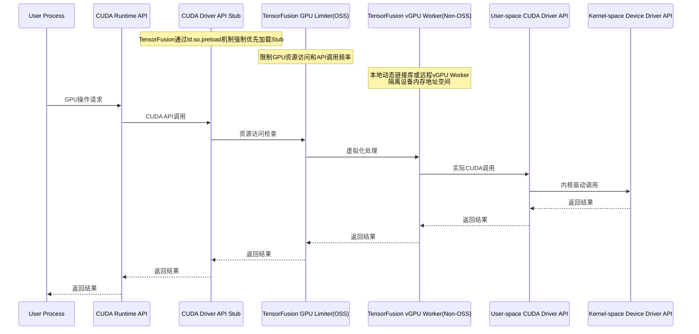
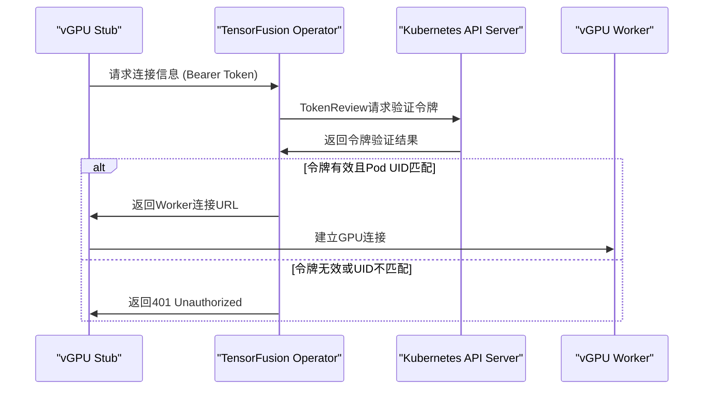
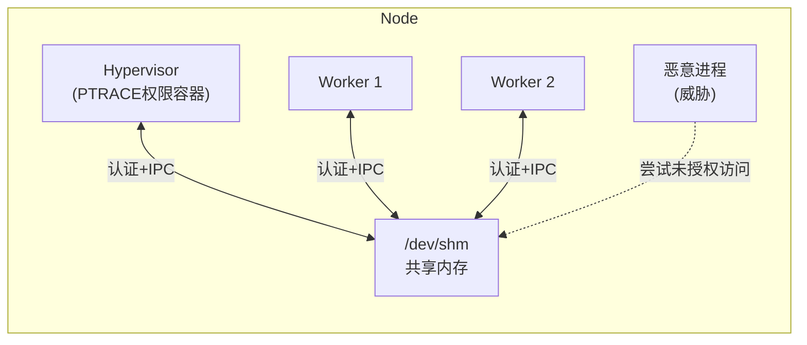
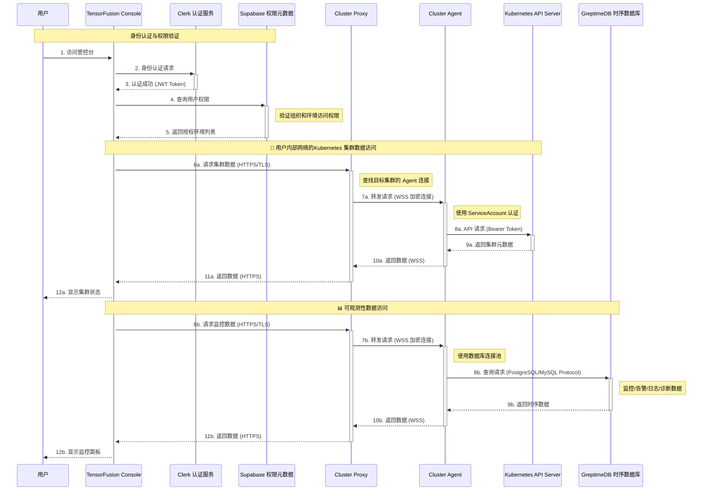

# TensorFusion 安全白皮书

## 1. 系统概述与架构

### 1.1 系统架构

#### 内嵌vGPU模式运行架构

#### 远程vGPU模式运行架构

上述架构图描述了TensorFusion服务的高层架构，包括组成TensorFusion服务的组件、信任边界和通信路径。

**范围**：本威胁建模仅涵盖TensorFusion服务，其他相关组件，如时序数据库、AI模型和框架等不在本次评估范围内。

**目标**：本评估旨在识别TensorFusion服务的潜在威胁，这些威胁可能被外部攻击者利用来攻击或渗透客户的云环境或数据中心。

### 1.2 系统组件

TensorFusion的核心组件包括：

- **控制器Operator**：管理和调度GPU资源的中央编排组件，在进程内运行了Controller、AdmissionWebhook、Scheduler、AlertEvaluator、MetricsRecorder、Scaler等子模块. Operator也负责启动一个一次性的NodeDiscovery Job用于上报GPU节点信息
- **虚拟化管理器Hypervisor**：处理GPU虚拟化的节点级组件，处理GPU节点上多个vGPU Worker的时间片分配、状态监控、性能统计等
- **工作节点vGPU Worker**：为应用程序提供用户态的vGPU实现，提供GPU访问接口，处理GPU系统调用，当运行在Local vGPU模式时，Worker的运行形态是嵌入用户进程的动态链接库
- **客户端vGPU Stub**：仅当运行在Remote vGPU模式时才会有此组件，作为动态链接库嵌入用户进程，配合Worker提供GPU访问接口，处理GPU系统调用

### 1.3 系统权限

TensorFusion是一个分布式系统，涉及多种信任边界，包括Kubernetes集群、Kubernetes节点、Pod网络和Pod内部容器运行时环境。以下是系统运行所需的所有权限：

**Operator组件的Kubernetes权限**：
- TensorFusion自定义资源权限：用于TensorFusion相关的各项核心功能
- Kubernetes原生工作负载和配置资源的读写权限（不包括Secret权限）：用于TensorFusion的各项核心功能
- Karpenter自定义资源的查询和创建权限：用于Karpenter集成时创建云服务商节点（不使用Karpenter时可删除）
- Kubernetes TokenReview权限：用于验证来自vGPU Stub获取vGPU Worker连接信息的请求
- Pod/bind子资源权限：用于TensorFusion自定义GPU调度器绑定Kubernetes节点
- Pod/exec子资源权限：用于ClusterAgent转发控制台WebShell请求（不使用WebShell时可删除）
- Lease读写权限：用于Controller选主

参考：https://github.com/NexusGPU/tensor-fusion/blob/main/charts/tensor-fusion/templates/rbac.yaml

**Hypervisor组件的Kubernetes权限**：
- Kubernetes TokenReview权限：用于验证来自vGPU Worker获取自身配额信息的请求
- Node/Pod/Namespace资源的只读权限：用于获取所在GPU节点的Pod信息
- GPU/GPUNode自定义资源的查询权限：用于获取和更新GPU信息

参考：https://github.com/NexusGPU/tensor-fusion/blob/main/charts/tensor-fusion/templates/rbac-hypervisor.yaml

**Pod容器运行时权限**：
- NodeDiscovery/Hypervisor组件对节点上所有GPU设备的访问权限：通过设置NVIDIA_VISIBLE_DEVICES=all环境变量，使NVIDIA Container Toolkit配置的CRI Hooks注入设备文件描述符，修改cgroup限制以访问节点上所有GPU设备
- Worker组件同样通过该环境变量挂载所有GPU设备，但通过向所有进程注入libcuda_limiter.so，实际只能访问调度器分配的GPU
- Hypervisor组件的Init Container以特权模式运行，用于一次性初始化节点上的tmpfs共享内存挂载点，该共享内存用于Hypervisor与Worker的进程间通信
- Hypervisor组件的主容器增加了SYS_PTRACE系统调用能力，用于读取/proc文件系统中vGPU Worker相关信息
- 其他工作负载无额外权限

参考：https://github.com/NexusGPU/tensor-fusion/blob/main/internal/utils/compose.go#L452

### 1.4 系统配置项

1. ConfigMap/tensor-fusion-sys-config/config/scheduler-config.yaml: 包括调度器相关配置，数据结构[与Kubernetes Scheduler相同](https://kubernetes.io/docs/reference/config-api/kube-scheduler-config.v1/#kubescheduler-config-k8s-io-v1-KubeSchedulerConfiguration)
2. ConfigMap/tensor-fusion-sys-config/config/dynamic-config.yaml：包括系统运行的[其他动态配置](./helm-install-values.md#properties-helm-values-dynamicConfig)，比如监控告警相关配置
3. ConfigMap/tensor-fusion-sys-public-gpu-info/gpu-info.yaml：枚举主流GPU型号和算力基准，用于GPU资源识别
4. MutatingWebhookConfiguration/tensor-fusion-sys-mutating-webhook
5. Secret/tensor-fusion-webhook-secret：AdmissionWebhook启动HTTPS服务器使用的TLS证书，由临时Job（kube-webhook-certgen）在Helm安装时生成，安装完成后自动删除

### 1.5 已实施的安全保障措施

#### 核心GPU虚拟化层

1. Local/Remote vGPU模式均实现显存地址隔离和故障隔离，避免vGPU越权访问风险（仅运行开源vgpu.rs组件时不提供显存地址隔离，显存隔离由非开源组件tensor-fusion-worker提供）
2. 对Remote vGPU客户端连接请求，使用Kubernetes ServiceAccount机制进行认证授权，避免伪造请求造成GPU资源滥用（Remote vGPU Stub为非开源组件）
3. Worker与Hypervisor通过共享内存进行跨进程通信前，基于Kubernetes ServiceAccount机制进行认证授权，避免请求伪造和越权访问

#### 编排调度层

1. 提供Namespace级的整体配额限制功能，减少GPU资源滥用风险
2. Kubernetes API、AdmissionWebhook TLS加密
3. TensorFusion组件实施最小化权限原则
4. 关键组件全部私有化部署，减小攻击面

#### 云端控制台

1. 云端控制台与Cluster Agent的认证授权、TLS加密
2. 云端控制台和ClusterAgent仅作请求代理，不存储数据，也可移除ClusterAgent组件，完全在内网模式运行，降低数据泄露风险
3. 云端控制台接入安全可靠的PaaS/SaaS服务提供商，如：接入Cloudflare实现DDoS和WAF防护；接入Clerk用户系统实现认证授权；接入Supabase/Upstash实现数据库和缓存的安全访问；接入Pulumi实现安全的密钥管理和基础设施自动化等。

## 2. 威胁模型分析

### 2.1 资产分类

**关键资产和数据：**
- A1: GPU硬件资源和分配状态
- A2: 远程共享GPU时使用的认证令牌
- A3: Kubernetes集群API Server访问凭据
- A4: TensorFusion所管理的Kubernetes集群中的用户工作负载
- A5: TensorFusion组件的配置信息
- A6: 系统监控指标和性能数据
- A7: 云端控制台的登录Session信息
- A8: 云端控制台与ClusterAgent通信的认证令牌

### 2.2 潜在威胁行为者

- **外部攻击者**：利用系统暴露的API，试图滥用GPU资源或窃取AI工作负载中的敏感数据
- **恶意内部人员**：利用合法的集群访问权限，试图提升权限或滥用GPU资源
- **供应链攻击**：利用受损的依赖项或容器镜像，试图植入恶意代码、滥用GPU资源、窃取AI工作负载中的敏感数据

### 2.3 STRIDE威胁分类参考

|威胁类型|期望属性|威胁定义|
|---|---|---|
|身份欺骗(Spoofing)|真实性|冒充其他身份或实体|
|篡改(Tampering)|完整性|修改磁盘、网络、内存或其他位置的数据|
|否认(Repudiation)|不可否认性|声称未执行某操作或不承担责任；可能是诚实或虚假的|
|信息泄露(Information Disclosure)|机密性|未授权获取信息|
|拒绝服务(Denial of Service)|可用性|耗尽提供服务所需的资源|
|权限提升(Elevation of Privilege)|授权|允许执行未授权的操作|

### 2.4 安全威胁分析

#### TM01: vGPU跨租户内存越权访问 (Tampering, Information Disclosure, Elevation of Privilege)

恶意用户可能尝试通过GPU显存地址操作，访问其他租户的GPU内存数据，造成数据泄露或权限提升。攻击者可能利用GPU内存管理漏洞，绕过虚拟化隔离机制，读取或修改其他工作负载的GPU内存内容。

**缓解措施**:
1. 实施显存地址隔离机制，确保不同vGPU实例间的内存空间完全隔离
2. 实现故障隔离，防止一个vGPU实例的错误影响其他实例
3. 使用VRAM管理器控制内存分配和访问权限

**状态**：在Local vGPU模式下部分缓解；在Remote vGPU模式和VM模式下已缓解。

**注意**：
- 在Local vGPU模式下，Stub和Worker与用户进程为同一进程，无法完全避免非可信用户通过修改共享内存中的GPU配额信息，绕过Stub直接访问GPU设备
- 在Worker运行为独立进程模式下，非可信租户的vGPU访问控制安全有效，包括：
  - 非容器环境的VM模式：Worker运行在Host上，通过共享内存设备与虚拟机中的Stub通信
  - Remote vGPU模式：Stub和Worker运行在独立容器中，通过TCP/IP或IB网络通信

#### TM02: Remote vGPU连接请求伪造 (Spoofing, Elevation of Privilege)

未授权的客户端可能伪造ServiceAccount令牌或绕过认证机制，获得对GPU Worker的连接权限，导致资源滥用和未授权访问。

**缓解措施**:
1. 使用Kubernetes ServiceAccount机制进行客户端身份认证
2. 验证令牌中的Pod UID与连接资源的Owner Reference匹配
3. 实施令牌缓存机制减少API Server负载，提高验证效率

**状态**：已缓解

#### TM03: Hypervisor-Worker IPC通信劫持 (Spoofing, Tampering, Information Disclosure)

恶意进程可能尝试通过共享内存通道劫持或窃听Hypervisor与Worker之间的进程间通信，获取GPU配额信息或注入恶意指令。

**缓解措施**:
1. Worker与Hypervisor通信前进行ServiceAccount令牌验证
2. 使用特权初始化容器配置共享内存挂载点，确保正确的访问权限
3. Hypervisor容器获得SYS_PTRACE能力监控相关进程状态

**状态**：已缓解

#### TM04: Kubernetes API未授权访问 (Spoofing, Elevation of Privilege)

攻击者可能尝试利用过度授权的ServiceAccount权限，执行超出组件职责范围的操作，如访问集群敏感资源或修改关键配置。

**缓解措施**:
1. 实施最小权限原则，为每个组件配置专用的RBAC权限
2. Hypervisor组件仅获得必要的TokenReview和资源查询权限
3. 移除不必要的权限，如WebShell和Karpenter权限可在不使用时删除

**状态**：已缓解

#### TM05: AdmissionWebhook篡改 (Tampering, Elevation of Privilege)

恶意用户可能尝试修改MutatingWebhookConfiguration，绕过Pod注入控制或插入恶意代码到工作负载中。

**缓解措施**:
1. 使用TLS加密保护AdmissionWebhook通信
2. 通过专用Secret管理Webhook TLS证书
3. 实施准入控制器身份验证，确保只有授权的Webhook能修改Pod规格
4. 集群管理员控制Webhook配置，确保只有授权的Webhook能被添加

**状态**：已缓解

#### TM06: GPU资源配额绕过 (Denial of Service, Elevation of Privilege)

恶意用户可能尝试请求过量GPU资源，导致其他用户无法获得资源或系统性能下降。

**缓解措施**:
1. 实施Namespace级整体配额限制功能，防止资源滥用
2. 使用QoS系统提供分级服务质量保证
3. 通过监控告警机制监控资源使用情况

**状态**：已缓解

#### TM07: 组件间通信窃听 (Information Disclosure)

网络攻击者可能尝试拦截TensorFusion组件间的通信，获取敏感的认证令牌或工作负载元数据。

**缓解措施**:
1. 所有涉及云端控制台的API访问使用TLS加密传输
2. 支持完全内网模式部署，移除外部通信依赖

**状态**：部分缓解。Remote vGPU Stub/Worker间的Kubernetes内网通信未在应用层加密，依赖用户的Kubernetes CNI网络配置实现流量加密。

#### TM08: 供应链攻击 (Tampering, Elevation of Privilege)

攻击者可能通过受损的容器镜像或依赖项，在TensorFusion组件中植入恶意代码，获取系统控制权限。

**缓解措施**:
TensorFusion的开发流程和DevOps管线采用GitHub开源项目推荐的各项安全实践，不断优化软件供应链安全。已实现的安全控制措施包括但不限于：

1. 使用安全的容器镜像构建制品
2. 开启Dependabot，定期更新依赖项和安全补丁 
3. 使用CodeQL进行代码安全扫描
4. 使用FOSSA Scan扫描开源依赖的合规性和许可证合法性
5. 团队GitHub账号开启MFA，遵循最小权限原则
6. CI/CD管线的密钥使用GitHub Secrets管理

**状态**：部分缓解，持续优化中。

## 3. 数据隐私

### 3.1 完全私有化部署模式

TensorFusion支持完全私有化部署模式，极大降低数据外网泄露风险。数据面的Worker组件在内存中即时处理GPU系统调用，LocalGPU模式无跨进程传输，RemoteGPU模式仅传输二进制数据，只有监控数据落盘，无客户数据泄露风险。

### 3.2 云端管控台+核心组件私有化部署模式

若启用云端管控台，用户通过Clerk进行身份认证后，可根据角色权限访问其组织内的Kubernetes集群元数据、监控/告警/日志/诊断报告等可观测性数据。

云端访问流程如下：

云端控制台和ClusterAgent组件的交互流程实现了几个关键的安全特性：
- TLS 加密
- 最小权限原则
- 数据不落盘
- 零信任架构

因此，TensorFusion控制台的设计显著缓解了数据泄露风险，保障了用户的数据隐私。

## 结论

TensorFusion通过采纳云原生和虚拟化领域的最佳安全实践，在vGPU的Host/Guest隔离、系统认证授权、资源管控、数据隐私、软件供应链等方面确保了默认配置下的安全设计。实施的主要安全控制措施包括：
- 实现多种vGPU隔离方案，确保多个非可信租户使用时的资源配额安全性，缓解计算资源滥用风险，并在可信租户场景下适当减弱隔离性以权衡性能
- 通过Kubernetes RBAC和AdmissionWebhook的最小权限原则，确保分布式组件交互的安全性
- 核心组件全部私有化部署，确保数据隐私，显著缓解可用性风险
- 可选的云端管控台通过有限的加密数据传输、无数据落盘等措施，保障控制面的安全访问
- 开发流程和CI/CD管线采纳GitHub开源项目的安全实践，增强软件供应链安全

总之，TensorFusion的系统架构在正确配置时，支持安全的多租户虚拟GPU共享和大规模GPU池的管理调度，需要持续关注部署安全实践，增强纵深防御，持续提升安全性。
